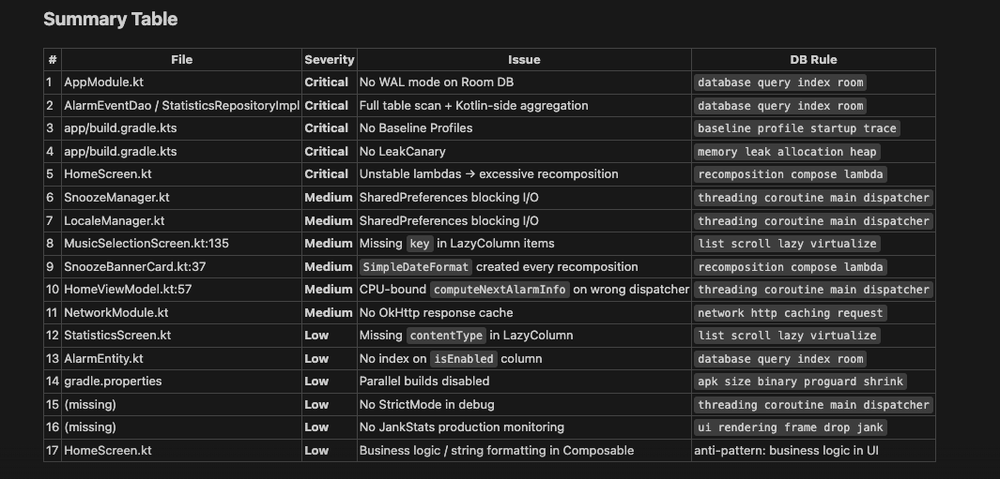
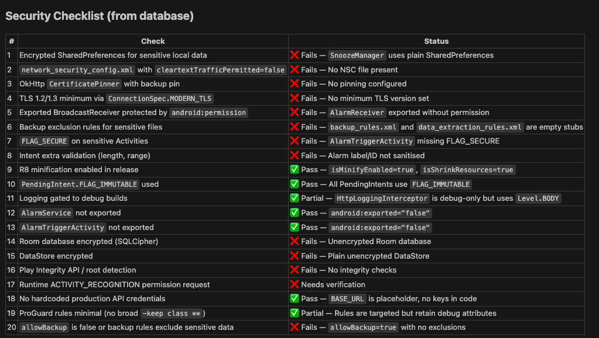

# Mobile Best Practices

Your AI assistant just got a mobile development brain upgrade.

**2,042 battle-tested best practices** — architecture, security, performance, anti-patterns, code snippets, and Gradle dependencies — packaged as an AI skill for Claude Code and 14 other AI coding assistants. Android, iOS, Flutter, React Native.

> Install once. Every code review, security audit, and performance check from that point forward pulls from a real database of 2,042 rules — not just your AI's training data.

---

## Install in 10 Seconds

```bash
cd /path/to/your/mobile/project
npx mobile-best-practices init
```

Pick your AI assistant and mobile platform. Done. Your `.gitignore` is updated automatically.

**One-liner options:**

```bash
npx mobile-best-practices init --ai claude --platform android
npx mobile-best-practices init --ai cursor --platform ios
npx mobile-best-practices init --ai windsurf --platform flutter
npx mobile-best-practices init --ai copilot --platform react-native
npx mobile-best-practices init --ai all --platform all
```

**Supports:** Claude Code · Cursor · Windsurf · GitHub Copilot · Kiro · Codex CLI · Gemini CLI · Roo Code · Continue · OpenCode · Qoder · CodeBuddy · Trae · Antigravity

---

## See It in Action

Real output from a real Android alarm clock app. Two commands.

### `/mobile-performance-check` — 17 findings



### `/mobile-security-audit` — 20 checks, 11 failures



Not generic advice. Every finding is linked to an exact rule from the database.

---

## What's Inside

| Category | Entries | What You Get |
|---|---|---|
| Architecture Patterns | 49 | MVVM, MVI, Clean Architecture, VIPER, TCA, BLoC, Redux, KMP |
| Design Patterns | 117 | Repository, Factory, Observer, Strategy, Adapter, code smells |
| UI Patterns | 91 | Navigation, lists, sheets, inputs, modals, animations, onboarding |
| Anti-Patterns | 120 | God Activity, memory leaks, prop drilling, setState abuse |
| Libraries | 103 | Retrofit, Hilt, Coil, Kingfisher, Dio, BLoC, Redux, Apollo, Koin |
| Performance | 228 | Startup, rendering, memory, network, Compose, CI/CD, monitoring |
| Security | 437 | Encryption, keychain, SSL pinning, biometric, compliance, privacy |
| Testing | 73 | Unit, UI, integration, E2E, screenshot, contract, fuzz testing |
| Reasoning Rules | 56 | Smart recommendations based on your product type |
| Project Templates | 18 | Starter configs for common app types |
| Code Snippets | 80 | Copy-paste templates for Android, iOS, Flutter, React Native |
| Gradle Dependencies | 78 | Ready-to-paste dependency declarations and plugins |
| Platform Guidelines | 592 | Android (423), iOS (60), Flutter (54), React Native (55) |

Every entry includes a **Reference URL** linking to official docs, GitHub repos, or guides.

---

## How It Works

After installation, your AI assistant searches 2,042 best practices through a built-in BM25 search engine. **You don't need to learn any commands** — just chat naturally.

```
You: "Build a login screen for my banking app"

AI assistant automatically:
  1. Searches architecture patterns → recommends MVVM + Clean Architecture
  2. Searches security practices → encryption, biometric auth, SSL pinning
  3. Searches code snippets → ViewModel, Repository, Compose screen templates
  4. Searches anti-patterns → warns about common banking app mistakes
  5. Generates production-ready code following all best practices
```

### Slash Commands (Claude Code & Cursor)

Type `/` to see all available commands:

| Command | What It Does |
|---|---|
| `/mobile-best-practices` | Invokes the main skill |
| `/mobile-security-audit` | Full security audit against 437 rules — finds hardcoded secrets, insecure storage, missing SSL pinning, and more |
| `/mobile-performance-check` | Performance analysis against 228 rules — finds recomposition issues, thread violations, slow startup, memory leaks, and more |
| `/mobile-setup-android` | Scaffolds a new Android project with the full best-practice stack |

---

## Use Cases & Examples

### "Audit my project for security issues"

Scans your entire codebase against 437 security best practices:

```
"Check my Android project for security vulnerabilities"
"Audit my iOS app for data privacy issues"
"Review my Flutter app for OWASP mobile top 10"
"Are there any hardcoded API keys or secrets in my project?"
```

Catches issues like:
- Hardcoded API keys and secrets
- Insecure data storage (SharedPreferences, UserDefaults)
- Missing SSL/certificate pinning
- Improper encryption usage
- Insecure authentication flows
- Missing root/jailbreak detection
- Sensitive data in logs or crash reports

### "Check my project for performance issues"

Reviews your code against 228 performance rules:

```
"Find performance issues in my Android app"
"Why is my app startup slow?"
"Review my Compose code for unnecessary recompositions"
"Check my LazyColumn for performance problems"
"Audit my app's memory usage patterns"
```

### "Review my entire project"

Full audit across all domains:

```
"Do a full code review of my Android project"
"Audit my iOS app — architecture, security, performance, everything"
"Review my Flutter project and suggest improvements"
```

Reviews against:
- Architecture — is the structure maintainable?
- Anti-patterns — any God Activities, memory leaks, tight coupling?
- Security — any vulnerabilities or data leaks?
- Performance — any slow paths or wasted resources?
- Testing — adequate test coverage?
- Platform guidelines — following platform conventions?

### "Build a new feature"

Get production-ready code with best practices baked in:

```
"Build a product list screen with search and filtering"
"Add biometric authentication to my app"
"Create an offline-first data sync feature"
"Implement pull-to-refresh with pagination"
"Add a bottom navigation with 4 tabs"
```

### "Set up a new project"

Start with the right architecture from day one:

```
"Set up a new Android e-commerce app with Clean Architecture"
"Create a new iOS banking app — what architecture should I use?"
"Start a Flutter delivery app with BLoC pattern"
"What dependencies do I need for a React Native social media app?"
```

### "Help with Gradle setup"

Get exact, paste-ready dependency declarations:

```
"What Gradle dependencies do I need for Compose + Hilt + Room?"
"Set up my version catalog with latest stable versions"
"Add testing dependencies — JUnit, Mockk, Turbine"
"Configure code quality tools — Detekt, Ktlint, Spotless"
```

---

## Supported Platforms

| Platform | Default Stack |
|---|---|
| **Android** | Jetpack Compose + Hilt + Room + Retrofit + Coil + Navigation Compose |
| **iOS** | SwiftUI + Combine/async-await + SwiftData + URLSession + Kingfisher |
| **Flutter** | BLoC/Riverpod + Dio + Drift/Hive + GoRouter + CachedNetworkImage |
| **React Native** | Redux Toolkit/Zustand + Axios + MMKV + React Navigation + FastImage |

---

## Search Domains

| Domain | Entries | Use For |
|---|---|---|
| `architecture` | 49 | Choosing patterns (MVVM, MVI, Clean, VIPER, BLoC) |
| `designpattern` | 117 | Design patterns & code smell detection |
| `ui` | 91 | UI components, navigation, lists, inputs, animations |
| `antipattern` | 120 | Common mistakes to avoid |
| `library` | 103 | Libraries and dependencies |
| `performance` | 228 | Speed, memory, battery, rendering optimization |
| `security` | 437 | Encryption, auth, storage, compliance |
| `testing` | 73 | Unit, UI, integration, E2E testing |
| `reasoning` | 56 | Smart recommendations by product type |
| `template` | 18 | Project starter configurations |
| `snippet` | 80 | Copy-paste code templates |
| `gradle` | 78 | Gradle dependency declarations |

---

## Advanced: Manual Search

```bash
python3 scripts/search.py "mvvm clean architecture" --domain architecture
python3 scripts/search.py "compose state management" --platform android
python3 scripts/search.py "viewmodel hilt" --domain snippet
python3 scripts/search.py "compose room retrofit" --domain gradle
python3 scripts/search.py "security encryption" --domain security --json
python3 scripts/search.py "compose performance" --domain performance -n 10
```

| Flag | Description |
|---|---|
| `--domain` / `-d` | Search a specific domain |
| `--platform` / `-p` | Platform guidelines (android, ios, flutter, react-native) |
| `--stack` / `-s` | Filter by tech stack (compose, swiftui, flutter, react-native) |
| `--filter-platform` / `-fp` | Filter any domain results by platform |
| `--persist` | Save results as architecture blueprint markdown |
| `--max-results` / `-n` | Number of results (default: 3) |
| `--json` | Output as JSON |

---

## Project Structure

```
src/mobile-best-practices/          # Source of truth
├── SKILL.md                       # Skill metadata + instructions
├── data/                          # 16 CSV databases
│   ├── architectures.csv
│   ├── design-patterns.csv
│   ├── libraries.csv
│   ├── ui-patterns.csv
│   ├── anti-patterns.csv
│   ├── performance.csv
│   ├── security.csv
│   ├── testing.csv
│   ├── reasoning-rules.csv
│   ├── project-templates.csv
│   ├── code-snippets.csv
│   ├── gradle-deps.csv
│   └── platforms/
│       ├── android.csv
│       ├── ios.csv
│       ├── flutter.csv
│       └── react-native.csv
├── scripts/
│   ├── core.py                    # BM25 search engine
│   └── search.py                  # CLI interface
├── references/
│   ├── CODE-RULES.md              # Code generation rules
│   └── CHECKLIST.md               # Pre-delivery quality checklist
└── templates/
    ├── base/                      # Shared SKILL.md content
    └── platforms/                 # 15 AI platform configs

cli/                               # npm package (mobile-best-practices)
├── src/                           # TypeScript source
├── assets/                        # Bundled data for offline install
└── package.json
```

## Requirements

- Python 3.x (no external dependencies)
- Node.js 18+ (CLI installer only)

## Contributing

1. **Data changes** — Edit CSVs in `src/mobile-best-practices/data/`. Changes auto-propagate via symlinks.
2. **Search engine** — Edit `src/mobile-best-practices/scripts/core.py`.
3. **CLI** — Edit `cli/src/`, build with `npm run build` in `cli/`.
4. **Sync CLI assets** before publishing:
   ```bash
   cp -r src/mobile-best-practices/data/* cli/assets/data/
   cp -r src/mobile-best-practices/scripts/* cli/assets/scripts/
   cp -r src/mobile-best-practices/references/* cli/assets/references/
   cp -r src/mobile-best-practices/templates/* cli/assets/templates/
   ```

## License

MIT
